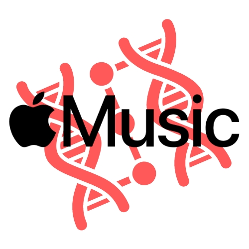

# Apple Music Clone (PERN Stack)

<p align="center">
  
</p>

<p align="center">
  This project is a clone of the Apple Music web application built using the PERN stack (PostgreSQL, Express.js, React.js, Node.js). It replicates the core functionalities of Apple Music, allowing users to browse, stream, and manage their music library.
</p>

## Features

<ul>
  <li>User authentication and authorization</li>
  <li>Music streaming</li>
  <li>Search functionality</li>
  <li>Playlist management</li>
  <li>Responsive design</li>
</ul>

## Technologies Used

<ul>
  <li><strong>Frontend</strong>: React.js</li>
  <li><strong>Backend</strong>: Node.js, Express.js</li>
  <li><strong>Database</strong>: PostgreSQL (hosted on Supabase)</li>
  <li><strong>Cloud Storage</strong>: Cloudinary (for audio files)</li>
  <li><strong>Hosting</strong>: Render.com</li>
</ul>

## Installation

### Prerequisites

<ul>
  <li>Node.js and npm</li>
  <li>PostgreSQL</li>
  <li>Cloudinary account</li>
</ul>

### Clone the Repository

```bash
git clone https://github.com/your-username/apple-music-clone.git
cd apple-music-clone
```


Install Dependencies
```bash
npm install
cd client
npm install
```

Configure Environment Variables
Create a .env file in the root directory and add the following:

DATABASE_URL=your_supabase_database_url
CLOUDINARY_CLOUD_NAME=your_cloudinary_cloud_name
CLOUDINARY_API_KEY=your_cloudinary_api_key
CLOUDINARY_API_SECRET=your_cloudinary_api_secret
JWT_SECRET=your_jwt_secret

Hosting
<p>The entire application is hosted on <a href="https://render.com">Render.com</a> and the database is hosted on <a href="https://supabase.io">Supabase</a>.</p>
License
<p>This project is licensed under the <a href="https://opensource.org/licenses/MIT">MIT License</a>.</p>
```